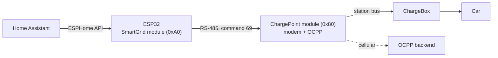

# esphome-evbox-smartgrid

> [!CAUTION]
> **Untested and unproven. Use entirely at your own risk.**
>
> - This component has **never been run on a real EVBox charger**. It was written from
>   EVBox's protocol document and community reverse engineering, and has so far only
>   been compiled.
> - Nothing in this repository is confirmed to work, to be safe, or to be correct for
>   your charger. That includes the connector and pinout in the installation guide.
> - Mistakes can damage the charger, the car or the electrical installation, overload
>   the very connection this is meant to protect, or affect warranty and insurance.
> - An EV charger carries mains voltage. Opening it and connecting anything inside is
>   work for a qualified electrician.
> - This project is not affiliated with or endorsed by EVBox. There is no support and
>   no warranty; see the [disclaimer](#disclaimer) and the [MIT license](LICENSE).
>
> Only use this if you can verify every step yourself and accept the consequences if
> something goes wrong.

An [ESPHome](https://esphome.io) external component that turns an ESP32 into the
**SmartGrid module** of an EVBox G3 charger. It uses the RS-485 interface EVBox
documented for third-party devices (*Protocol Max v4*, command 69) to set the
maximum charging current in real time, and reads back the current per phase, the
power factor and the charger's energy meter.

The charger's own communication module (the modem and its OCPP backend) stays in
place and keeps working. This component adds a local current limit on top of it,
controlled by Home Assistant.

## Status

| | |
|---|---|
| Compiles against ESPHome 2026.8.2 | checked in CI on every push |
| Frame format and checksum | checked against the example frame in the EVBox document |
| Works on a real charger | **not tested** |
| Location and pinout of the bus connector on the G3 modem | **not verified** |
| Fallback after the timeout | **not tested** |
| Pausing below the charger's minimum current | **not tested** |

## Why

A 3 × 16 A charger leaves little room on a 3 × 25 A connection. When the oven, the
dishwasher and the car all run, a phase goes over the main fuse. Cloud backends can
often only start or stop a session. This component is meant to let Home Assistant
lower the charging current locally, within seconds, and raise it again when there is
room.

## How it works



According to the EVBox document:

- Every `update_interval` the component sends command 69: the maximum current for L1,
  L2 and L3, a timeout, and a fallback current.
- The ChargePoint replies with the current in use per phase, cos φ and the meter
  reading.
- If the frames stop (ESP32 off, Wi-Fi gone, keep-alive switched off), the ChargePoint
  applies the fallback current once the timeout expires.
- The limit can only lower the charger's own maximum, never raise it.
- The car may take up to about 10 seconds to follow a new limit.

None of this has been observed on a real charger yet. Protocol details are in
[docs/protocol.md](docs/protocol.md).

## Hardware

- **Charger:** EVBox BusinessLine or HomeLine **G3**, with a separate modem board
  (for example 471046.x UMTS-E with a SIM5320E). The EVBox document also covers G4,
  but G4 hardware is not covered here.
- **ESP32 with a 3.3 V RS-485 transceiver.** The example uses an M5Stack
  [AtomS3 Lite](https://docs.m5stack.com/en/core/AtomS3%20Lite) with an
  [ATOMIC RS485 Base](https://docs.m5stack.com/en/atom/Atomic%20RS485%20Base), which
  accepts 6–24 V and powers the Atom from it. Transceivers built around a 5 V MAX485
  are reported not to work with 3.3 V microcontrollers. If your transceiver needs a
  direction pin, set `flow_control_pin` on the `uart:`.

Wiring, pin identification and commissioning are in
[docs/installation.md](docs/installation.md). Read its warnings first.

## Configuration

```yaml
external_components:
  - source: github://tmisker/esphome-evbox-smartgrid
    components: [evbox_smartgrid]

uart:
  id: evbox_bus
  tx_pin: GPIO6
  rx_pin: GPIO5
  baud_rate: 38400

evbox_smartgrid:
  id: evbox
  update_interval: 15s
  timeout: 60s
  fallback_current: 16

number:
  - platform: template
    name: Max charging current
    optimistic: true
    min_value: 0
    max_value: 16
    step: 1
    initial_value: 16
    restore_value: true
    unit_of_measurement: A
    on_value:
      - lambda: id(evbox).set_max_current(x);
```

A complete device configuration is in [example/evbox-smartgrid.yaml](example/evbox-smartgrid.yaml).

### `evbox_smartgrid`

| Option | Default | Description |
|---|---|---|
| `uart_id` | | UART bus, 38400 baud, 8N1. |
| `update_interval` | `15s` | How often command 69 is repeated. Frames are never sent more often than the minimum interval the ChargePoint reports. |
| `timeout` | `60s` | Sent to the ChargePoint. Without a frame for this long, it should switch to `fallback_current`. Must be at least twice `update_interval`. |
| `max_current` | `16` | Initial maximum current per phase, in A. |
| `fallback_current` | `16` | Current per phase the ChargePoint should apply when the frames stop, in A. |

Methods for lambdas:

| Method | Description |
|---|---|
| `set_max_current(float amps)` | New limit per phase. Sent right away when it changes. Values below the charger's minimum (usually 6 A) are expected, but not confirmed, to pause charging. |
| `set_keepalive_enabled(bool)` | Stop or resume sending. When stopped, the ChargePoint should fall back after the timeout. |
| `get_max_current()`, `is_keepalive_enabled()` | Current settings. |

### Sensor platform

| Key | Unit | Description |
|---|---|---|
| `current_l1`, `current_l2`, `current_l3` | A | Current in use per phase. |
| `power_factor_l1`, `power_factor_l2`, `power_factor_l3` | | cos φ per phase. |
| `energy` | kWh | Meter reading of the charger. |
| `minimum_current` | A | Minimum current the ChargeBox needs to charge. |
| `connection_max_current` | A | Maximum current of the connection, as known to the ChargePoint. |
| `minimum_interval` | s | Shortest interval between frames the ChargePoint accepts. |

With more than one ChargeBox on a ChargePoint, the sensors show the first one.

### Binary sensor platform

| Key | Description |
|---|---|
| `responding` | On while the ChargePoint answers; off after about three missed replies. |

## Using it from Home Assistant

The limit is an ordinary number entity, so any automation can set it:

```yaml
action: number.set_value
target:
  entity_id: number.evbox_smartgrid_max_charging_current
data:
  value: 10
```

Keep the decision logic in Home Assistant, where the whole house's consumption is
known. Lower the limit quickly and raise it slowly, so heaters that cycle on and off
do not make the charging current jump up and down. Do not rely on this component as
your only protection against overloading a connection: the main fuse and the
installation's own protection stay essential.

## Safety

- The ChargePoint is documented to cap the limit at the connection's maximum, but it
  trusts the numbers you send. Never set `fallback_current` or the number's maximum
  above what the installation, cable and car can handle.
- Only command 69 is sent. The internal station bus between ChargePoint and ChargeBox
  uses other commands; experimenting with those has
  [bricked a ChargeBox](https://www.geekabit.nl/projects/managed-ev-charger-to-stand-alone/#bricked)
  before. Do not connect this component to that bus.
- EVBox has stopped trading. There is no manufacturer support.

## Credits

- **EVBox** for publishing *Protocol Max v4 – Third party interface*.
- **Maarten Tromp ([geekabit](https://www.geekabit.nl/projects/managed-ev-charger-to-stand-alone/))**
  for documenting the internal protocol and the G2/G3 hardware.
- **[ajvdw/evbox](https://github.com/ajvdw/evbox)** and
  **[BerndSchrooten/home-assistant-esphome-evbox-controller](https://github.com/BerndSchrooten/home-assistant-esphome-evbox-controller)**
  for earlier ESPHome implementations of command 69.
- **[sequ3ster/protocol-max](https://github.com/sequ3ster/protocol-max)** for an earlier
  Arduino library for the same protocol.
- **[Ricardo Schluter](https://github.com/ricardoschluter/evbox-g2-esphome-controller)**
  for an ESPHome controller for G2 on the same M5Stack hardware.
- **[Harm Otten](https://olino.org/blog/us/articles/2019/07/17/smart-charging-at-home-and-more/)**
  for early reverse engineering of the EVBox bus.

No code from these projects is included.

## Disclaimer

This software and its documentation are provided "as is", without warranty of any
kind, express or implied. It is an untested prototype. The authors are not liable for
any damage to chargers, vehicles, electrical installations, property or persons, or
for any other consequence of using it. You alone are responsible for deciding whether
to use it, for any modification to your charger, and for complying with local
regulations and with the conditions of your warranty and insurance.

## License

MIT, see [LICENSE](LICENSE). EVBox is a trademark of its owner; this project is not
affiliated with EVBox. The EVBox protocol document is not included in this repository.
